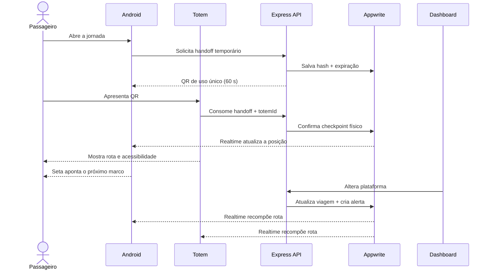

# Arquitetura

## Responsabilidades

```text
Android (passageiro) ─┐
React Totem (kiosk) ──┼─ Appwrite Auth + Realtime
React (operador) ─────┘
        │
        └──── HTTPS ─── Express API ─── Appwrite (credencial de servidor)
                                      ├─ dados
                                      ├─ storage
                                      └─ messaging (P1)
```

## Sequência da jornada entre superfícies



### Android

Kotlin, Jetpack Compose, Navigation Compose, ViewModel/StateFlow, CameraX + leitor QR e sensores Android (`TYPE_ROTATION_VECTOR`, com fallback de magnetômetro/acelerômetro). O SDK Android do Appwrite mantém sessão; o app chama a API Express com o token/sessão do usuário e assina eventos autorizados pelo Appwrite Realtime.

### Dashboard

React + TypeScript + Vite, React Router e TanStack Query. Usa o SDK Web apenas para login/sessão e Realtime. Mutações administrativas passam pela API Express.

### Totem

React + TypeScript + Vite em PWA/kiosk. Usa identidade técnica limitada por dispositivo e sessões de jornada efêmeras emitidas pela API. Não armazena credenciais administrativas, PII ou token da jornada após timeout. Um `TOTEM_ID` identifica o ponto físico e permite que o checkpoint seja confirmado automaticamente.

### API

Node.js LTS, Express e TypeScript. Camadas: routes → middleware de autenticação → services → repositories Appwrite. Validar payloads com schemas e usar logs estruturados. A API valida a sessão recebida e verifica membership no time `operators` para ações operacionais.

### Appwrite

- Auth: e-mail/senha no P0.
- Team `operators`: autorização do dashboard.
- Database `embarque`: dados de domínio.
- Realtime: alertas e atualização da viagem.
- Storage `terminal-assets`: imagens/mapas opcionais.
- Messaging: push apenas no P1.

## Modelo de dados mínimo

| Tabela/coleção | Campos principais | Escrita |
|---|---|---|
| `profiles` | `userId`, `name`, `accessibilityPrefs` | próprio usuário |
| `terminals` | `name`, `city`, `timezone` | operador |
| `terminal_points` | `terminalId`, `code`, `name`, `kind` | operador |
| `totems` | `terminalId`, `pointId`, `label`, `status`, `lastSeenAt` | API/operador |
| `routes` | `terminalId`, `fromPointId`, `toPointId`, `steps[]`, `headingDegrees`, `distanceMeters`, `accessible` | operador |
| `trips` | `ownerId`, `origin`, `destination`, `departureAt`, `platform`, `status` | API/operador |
| `journeys` | `tripId`, `userId`, `currentPointId`, `stage`, `checklist` | próprio usuário/API |
| `alerts` | `tripId`, `type`, `severity`, `message`, `platform`, `createdAt` | operador |
| `feedback` | `journeyId`, `rating`, `tags`, `comment` | próprio usuário |
| `help_requests` | `journeyId?`, `totemId`, `category`, `status`, `createdAt` | totem/operador |
| `handoff_sessions` | `journeyId`, `totemId?`, `tokenHash`, `expiresAt`, `consumedAt` | API |

O Appwrite usa IDs nativos como chave. Criar índices para `ownerId + departureAt`, `tripId + createdAt`, `terminalId + code` e `userId + stage`.

## Endpoints Express P0

| Método | Endpoint | Uso |
|---|---|---|
| GET | `/health` | prontidão da API |
| GET | `/v1/me/trips/next` | próxima viagem do passageiro |
| GET | `/v1/trips/:id/journey` | visão consolidada da jornada |
| PATCH | `/v1/journeys/:id/checklist` | atualizar checklist |
| POST | `/v1/journeys/:id/checkpoints` | validar QR/código |
| POST | `/v1/journeys/:id/handoffs` | gerar QR/token temporário |
| POST | `/v1/totems/:id/handoffs/consume` | vincular jornada ao totem uma vez |
| POST | `/v1/totems/:id/help-requests` | pedir ajuda com contexto |
| POST | `/v1/journeys/:id/complete` | concluir jornada |
| POST | `/v1/feedback` | registrar avaliação |
| GET | `/v1/ops/trips` | painel do operador |
| POST | `/v1/ops/trips/:id/alerts` | publicar alerta/mudar plataforma |

## Permissões

- Passageiro lê apenas seus `trips`, `journeys`, `alerts` relacionados e `feedback`.
- Dados de terminal/rota podem ser leitura pública autenticada.
- Operador escreve viagens, rotas e alertas via API.
- Chave Appwrite server-side existe apenas em secret do ambiente da API.
- Dashboard e Android recebem endpoint e project ID públicos, nunca a API key.
- Totem só acessa dados da sessão efêmera; não consegue listar passageiros/viagens.
- Token de handoff é aleatório, uso único, expira em 60 s e é armazenado somente como hash.
- Sessão visível do totem expira por inatividade; logs não registram localizador ou token.

## Orientação direcional

Cada trecho curado possui um azimute esperado (`headingDegrees`). O Android calcula a menor diferença angular entre o azimute e a orientação filtrada do aparelho, anima a seta e exibe a instrução textual. Um filtro de suavização reduz tremor. A confiança considera precisão reportada pelo sensor e variação das últimas leituras. O recurso é auxílio visual: checkpoint e instrução textual continuam sendo a fonte de verdade.

## Ambientes

Usar três configurações: local, demo/pitch e produção. Para o pitch, congelar seed e versão pelo menos 24 horas antes. O project ID fornecido pode ser usado como ambiente demo; não misturar dados pessoais reais.

## Decisão de monorepo

Manter tudo junto reduz coordenação, centraliza documentação e permite uma única esteira de CI. O Android continua sendo um projeto Gradle independente dentro de `apps/mobile`; npm workspaces cuidam de `api`, `dashboard`, `totem` e pacotes TypeScript. Dashboard e totem compartilham componentes visuais, mas são builds e permissões separados.
